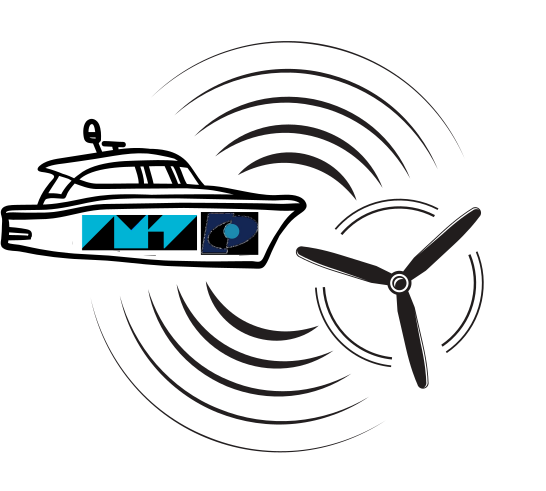
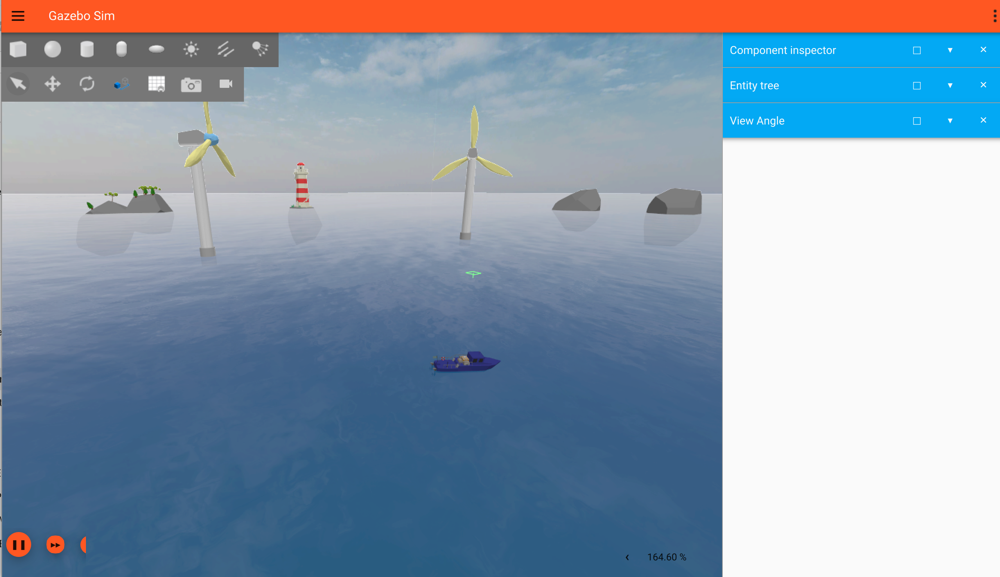

  
    <h1>IMT'ENSTA - Aquabot Challenge</h1>
    <h3>Maritime drone simulation to inspect an offshore wind farm</h3>
    Made by <a href="https://www.linkedin.com/in/kouassi-fieni-jean-yao-360850209/">Kouassi Fieni Jean YAO</a> and <a href="https://www.linkedin.com/in/theovidal/">Théo VIDAL</a>

## How it works

This simulation runs on ROS2 using provided packages from SIREHNA, the entity that organizes the challenge. Our maritime drone must follow different steps:

- Explore the environment and get the coordinates of all wind turbines by scanning a QR code
- After sending all data, visit the turbine that is damaged
- Stay still in front of this turbine
- (Optional) turn around the turbine by keeping the drone oriented towards it

All of our project management and system engineering process are on our [Notion page](https://theo-vidal.notion.site/AQUABOT-Challenge-IMT-ENSTA-11211af0c680801e8301f94d2887e800?pvs=4) (in French).

## Showcase

Videos and images are published as features are developed. Stay tuned!

## Develop

Make sure to have installed all prerequisites:

- Git
- ROS2
- Gazebo

### Scripts

All scripts are located in the `scripts/` folder. They are utilities to build and run the project :

- [build](scripts/build): build all packages located in `~/vrx_ws`, including the project
- [run](scripts/run): run the node of this project
- [build_run](scripts/build_run): combination of both
- [sim](scripts/sim): start the simulation window
- [rviz2](scripts/rviz2): launch rviz2 utility, to visualize the scene and topics
- [topics](scripts/topics): interact with ROS2 topics

## Credits

- A challenge from [SIREHNA (Naval Group)](https://www.sirehna-challengeaquabot.com/)
- Maintainers:
  - [Kouassi Fieni Jean YAO](https://www.linkedin.com/in/kouassi-fieni-jean-yao-360850209)
  - [Théo VIDAL](https://www.linkedin.com/in/theovidal/)

## License

Do Whatever You Want.
